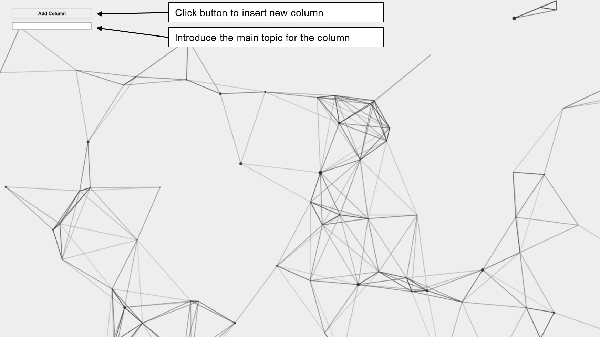

# kanban-project-management

## Description

## Table of Contents

- [Installation](#installation)
- [Features](#features)
- [Usage](#usage)
- [Technologies](#technologies)
- [Screenshots](#screenshots)
- [Contact](#contact)

## Installation

Before you begin, ensure you have met the following requirements:

### Prerequisites

- You have installed [Node.js and npm](https://nodejs.org/en/download/)
- You have a Windows/Mac/Linux machine.

### Installing

To install the project, follow these steps:

1. Clone the repository:

   ```
    git clone https://github.com/jparraporcar/kanban-project-management.git
   ```

2. Navigate into the project directory:

   ```
   cd kanban-project-management
   ```

3. Install dependencies:

   ```
   npm install
   ```

4. To start the server:
   ```
   npm start
   ```

## Features

<figure>
  <figcaption>Add new column</figcaption>
  <br />
  <br /> 
  
</figure>

## Usage

## Technologies

## Screenshots

## Contact

If you want to contact me you can reach me at:

- **Name**: `Jordi Parra Porcar`
- **Email**: `jordiparraporcar@gmail.com`
- **LinkedIn**: [`Jordi Parra Porcar`](https://www.linkedin.com/in/jordiparraporcar/)

For any additional questions or comments, please feel free to reach out. Contributions, issues, and feature requests are welcome!
